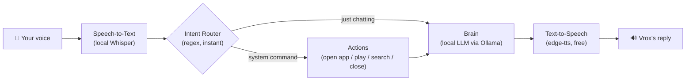

# 🎙️ Vrox — a free, local, Hindi/English voice companion

Vrox is a voice assistant that runs entirely on your own computer. It talks
to you like a friend with a calm, deep, "heavy" voice — the friendly senior
-interviewer energy, not high-pitched or overly cheerful — mixing Hindi and
English naturally, the way real bilingual conversations go. It can also
control your PC: opening apps, browsing, playing songs/videos on YouTube —
all from voice commands.

It was built as an end-to-end portfolio project: local speech recognition,
a local LLM for conversation, natural text-to-speech, a rule-based command
router for system control, and a small client-server layer so you can talk
to it from your phone over your home WiFi.

**Cost to run: ₹0 / $0.** Every default component is free and open-source.
See [docs/SETUP.md](docs/SETUP.md#cost-breakdown) for the exact breakdown
and the one optional paid upgrade path (ElevenLabs voices).

**🔗 Try the live demo:** _add your deployed link here after following
[docs/DEPLOY.md](docs/DEPLOY.md)_ — a public, chat-only version anyone can
open in a browser, no install needed (see the note below on why system
control is local-only).

---

## What it can do

| You say (Hindi, English, or mixed) | Vrox does |
|---|---|
| "Open Chrome" / "Chrome khol do" | Launches Chrome |
| "Open notepad" | Launches Notepad / TextEdit / gedit |
| "Play believer on youtube" / "Arijit Singh wala gaana bajao" | Searches & plays it on YouTube |
| "Search for best laptops 2026" | Opens a Google search in a new tab |
| "Close chrome" | Closes the app |
| "Yaar aaj mera mood off hai" | Just... talks to you, like a friend would |

## How it works, in one picture



Full breakdown of every box, and the reasoning behind each choice, is in
[docs/ARCHITECTURE.md](docs/ARCHITECTURE.md).

## Running it

**Easiest — one click, nothing to type:**
Double-click `start_vrox.bat` (Windows) or run `./start_vrox.sh` (Mac/Linux).
The first run installs everything it needs automatically (Python packages,
the local AI model); every run after that starts in seconds. Once the
window opens, Vrox is already listening — **just start talking**, no
button, no Enter key. Say "stop listening" or press Ctrl+C to quit.

**Manual alternatives**, once your environment is set up (`docs/SETUP.md`):

1. **CLI (hands-free)** — same experience as the launcher:
   ```bash
   python vrox_cli.py
   ```
2. **LAN web app** — run the server on your PC, then open the page from
   your phone (or PC) on the **same WiFi network** — a push-to-talk remote
   control with an animated avatar that reacts while it listens, thinks,
   and talks.
   ```bash
   uvicorn src.server:app --host 0.0.0.0 --port 8000
   # then visit http://<your-pc-lan-ip>:8000 from any device on the same WiFi
   ```

Full step-by-step setup (installing Ollama, pulling a model, Python deps)
is in [docs/SETUP.md](docs/SETUP.md).

## Project structure

```
vrox-voice-agent/
├── src/
│   ├── config.py          # all settings + the personality system prompt, in one place
│   ├── stt.py              # ears: mic -> text (local Whisper)
│   ├── tts.py               # voice: text -> speech (edge-tts, offline fallback, optional ElevenLabs)
│   ├── intent_router.py    # fast rule-based command detector (open/play/search/close vs. chat)
│   ├── actions.py           # hands: actually opens apps / plays media / closes windows
│   ├── brain.py              # local LLM conversation via Ollama
│   ├── memory.py            # short-term conversation history (a bounded list, nothing fancier)
│   ├── pipeline.py          # wires stt/router/actions/brain together — one shared "turn" of logic
│   └── server.py             # FastAPI app for LAN/web access
├── web/
│   └── index.html            # push-to-talk browser UI with an animated avatar
├── vrox_cli.py               # hands-free entry point: talk to Vrox directly on your PC
├── start_vrox.bat             # one-click launcher (Windows) — installs + runs, no typing
├── start_vrox.sh              # one-click launcher (Mac/Linux)
├── tests/                     # unit tests for the pure-logic parts (router, actions dispatch)
├── docs/
│   ├── ARCHITECTURE.md        # why each component was chosen, full data flow
│   ├── SETUP.md                # install + run instructions, cost breakdown
│   └── INTERVIEW_NOTES.md      # how to talk about this project in an interview
├── .github/workflows/ci.yml    # lint + test on every push (GitHub Actions)
├── requirements.txt
└── pyproject.toml
```

## Why the live demo can only chat, not control your screen

A voice agent that opens apps and controls a screen has to run **on the
machine it's controlling** — it needs a real microphone, real speakers, and
OS-level permission to launch/close programs. That can't be hosted on a
generic cloud server the way a website can. So this project deploys what's
honestly deployable, as two separate things:

- The **source code + CI pipeline** live on GitHub (lint + tests run on
  every push).
- The **app itself**, in full "control my PC" form, runs locally on your
  machine, and is reachable from any other device on your **home WiFi**
  through the built-in web server — a genuinely useful, real deployment
  pattern (the same one smart-home hubs, Home Assistant, Plex, etc. all
  use).
- A **public chat-only demo** ([docs/DEPLOY.md](docs/DEPLOY.md)) also runs
  in the cloud for free (Hugging Face Spaces / Render + Groq's free API
  instead of a local model) so anyone can try the conversation and
  personality from a link — with system actions ("open Chrome", "play
  x on YouTube") intentionally turned into an explanation instead of a
  real action, since there's no desktop behind a public server to control,
  and letting strangers trigger subprocess calls on a shared server is a
  bad idea on principle regardless.

This distinction — deployable-for-real-use vs. hostable-as-a-demo — is
explained in more depth in
[docs/ARCHITECTURE.md](docs/ARCHITECTURE.md#why-no-live-cloud-deployment),
and is worth being able to explain confidently in an interview: it shows
you understand the difference between "deployable" and "hostable" systems.

## License

MIT — do whatever you like with it.
