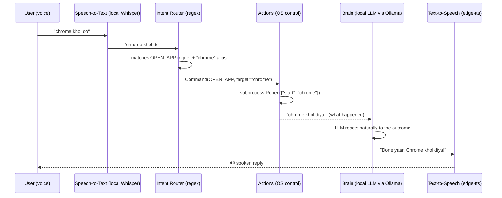

# Architecture

## Design philosophy

Every choice in this project optimizes for three things, in order:

1. **Zero/near-zero cost** — nothing here requires a paid API key by default.
2. **Explainability** — every component is something you could sketch on a
   whiteboard in an interview in under a minute. No hidden magic, no
   frameworks doing unexplainable things.
3. **Low latency** — a voice conversation that takes 5+ seconds to respond
   doesn't feel natural, so cheap/instant steps (regex routing) are used
   wherever an expensive one (an LLM call) isn't actually needed.

## Full data flow

For plain conversation ("aaj mausam kaisa hai"), the router finds no
command match, so the text is sent straight to the Brain — no Actions step.

## Component-by-component reasoning

### 1. Speech-to-Text — `src/stt.py`
**What:** `faster-whisper`, a fast CTranslate2 build of OpenAI's open-source
Whisper model, run entirely on your CPU.
**Why this over an API (e.g. Google Speech, ElevenLabs STT, Whisper API):**
zero cost, zero network dependency, and Whisper is multilingual by default
— it transcribes Hindi, English, and mixed Hinglish speech without any
extra training or configuration.
**Interview soundbite:** *"I run a local Whisper model instead of hitting a
cloud STT API — it's free, keeps the audio private, and Whisper already
understands code-switched Hindi/English out of the box."*

### 2. Intent Router — `src/intent_router.py`
**What:** a small set of regex patterns + a dictionary of app aliases
(English + Hindi) that classify a sentence into either a structured
`Command` (open app / play media / search / close app) or `CHAT` (fall
through to the LLM).
**Why rule-based instead of asking the LLM to decide:** speed (a regex
match is sub-millisecond vs. hundreds of ms to seconds for an LLM call) and
reliability ("open chrome" should always open chrome, not depend on model
sampling that day). This is the same idea behind slot-filling/intent
classifiers in classic dialogue systems (like Rasa or Dialogflow), just
implemented by hand so it's fully transparent and free.
**Interview soundbite:** *"I deliberately kept NLU simple — regex-based
intent detection — rather than reaching for a heavier classifier, because
the command vocabulary is small and bounded, and simple + explainable beats
clever here."*

### 3. Actions — `src/actions.py`
**What:** one function per action (`open_app`, `play_media`, `search_web`,
`close_app`, `open_url`), each branching on `platform.system()` to run the
right OS-native command (Windows/macOS/Linux).
**Why:** keeps every "how do I open Chrome on this OS" detail in exactly
one file, so nothing else in the app needs to know or care what OS it's
running on.

### 4. Brain — `src/brain.py` + `src/memory.py`
**What:** a local LLM (default: `qwen2.5:7b-instruct`, chosen for strong
bilingual Hindi/English ability) served by [Ollama](https://ollama.com),
called with a system prompt that defines Vrox's friendly, casual,
Hinglish-mixing personality (see `src/config.py`). Conversation history is
just a Python list capped to the last 12 exchanges — no vector database,
no embeddings.
**Why local instead of a cloud LLM API:** zero per-token cost, and this is
the single biggest cost driver in most "AI agent" projects, so removing it
was the highest-leverage decision in this whole project.
**Interview soundbite:** *"The most expensive part of most voice agent
demos is LLM API calls per turn. I moved that entirely local with Ollama,
so this can run indefinitely for a live demo without worrying about a
credit meter."*

### 5. Text-to-Speech — `src/tts.py`
**What:** `edge-tts` (Microsoft Edge's free neural TTS, no API key) as the
default, with a fully-offline `pyttsx3` fallback if there's no internet,
and an optional ElevenLabs path if you deliberately want to spend
ElevenLabs free-tier credits for an even more natural voice.
**Why this ordering:** edge-tts sounds close to a real human voice and
supports good Hindi + Indian-English voices, for literally $0. ElevenLabs
is excellent but metered — kept as an opt-in upgrade, never the default, in
line with "credits cost should be minor to minor."

### 6. Pipeline — `src/pipeline.py`
**What:** the one shared function (`handle_text`) that both entry points
(CLI and web server) call. It's the single place that defines "what
happens when Vrox hears something," so the logic is never duplicated.

### 7. Two entry points
- `vrox_cli.py` — talks directly through your PC's mic/speakers. Simplest
  possible demo, zero network layer.
- `src/server.py` + `web/index.html` — a small FastAPI server + a
  push-to-talk browser page, so you can open the page on your **phone**
  (same WiFi as your PC) and control your computer remotely. This is a
  classic client-server pattern: the browser only records audio and plays
  back a reply; every actual decision and every actual system action
  happens on the server (i.e., on your PC).

## Why no "live" cloud deployment

This came up directly while scoping the project, so it's worth stating
explicitly: **an agent that opens apps and controls a screen must run on
the machine being controlled.** There is no way to meaningfully deploy
"open Chrome on my laptop" to a generic cloud server — the server doesn't
have your laptop's screen, apps, or window manager.

So instead of pretending otherwise, this project deploys what's honestly
deployable:

- **GitHub** hosts the source code, with **GitHub Actions CI** running
  lint + unit tests on every push — this is real, live, continuously
  running automation, just not a hosted *server*.
- The **app** is "deployed" onto your own machine and reachable from other
  devices on your home network — a legitimate, common deployment pattern
  (this is exactly how Home Assistant, Plex, and most self-hosted smart
  -home software work).

There is one cloud-hosted piece: a public, chat-only **demo** deployment
(see [docs/DEPLOY.md](DEPLOY.md)). It follows exactly the split described
above — voice + system control stay local-only concepts — by swapping just
two components behind the same interfaces, selected at runtime by
`VROX_LLM_PROVIDER` / `VROX_STT_PROVIDER` in `src/config.py`:

- `src/brain_cloud.py` — `GroqBrain`, same `.reply()` shape as `Brain`, but
  calling Groq's free hosted API instead of a local Ollama model (no
  GPU/RAM on a free box for a 7B model).
- `src/stt_cloud.py` — `GroqSpeechToText`, same `transcribe_file()` shape
  as `SpeechToText`, using Groq's free hosted Whisper endpoint instead of
  loading `faster-whisper` locally.

`src/pipeline.py` also checks `settings.demo_mode` (auto-on whenever the
Groq provider is selected) and skips actually running `src/actions.py`'s
subprocess/psutil calls in that mode — there's no desktop behind a public
server to control, and executing system calls triggered by anonymous
internet visitors would be a bad idea regardless of whether anything useful
would happen. The LLM still replies, just explaining that the action only
works when Vrox runs on your own machine. `vrox_cli.py` and the local LAN
server never touch any of this — they always use the local, free, offline
path by default.

## Known limitations (good interview material — shows self-awareness)

- Whisper's accuracy on heavily code-switched Hinglish is good but not
  perfect, especially with background noise.
- The intent router is rule-based, so a command phrased very differently
  than the patterns it knows won't be recognized as a command (it'll just
  be treated as chat instead) — a real product would eventually want a
  small trained classifier or LLM function-calling here, once the command
  vocabulary grows past what regex can comfortably cover.
- Conversation memory is short-term only (last ~12 exchanges); there's no
  persistent long-term memory across sessions yet.
- `close_app` matches by process name, which can occasionally miss apps
  with unusual process names on some systems.
